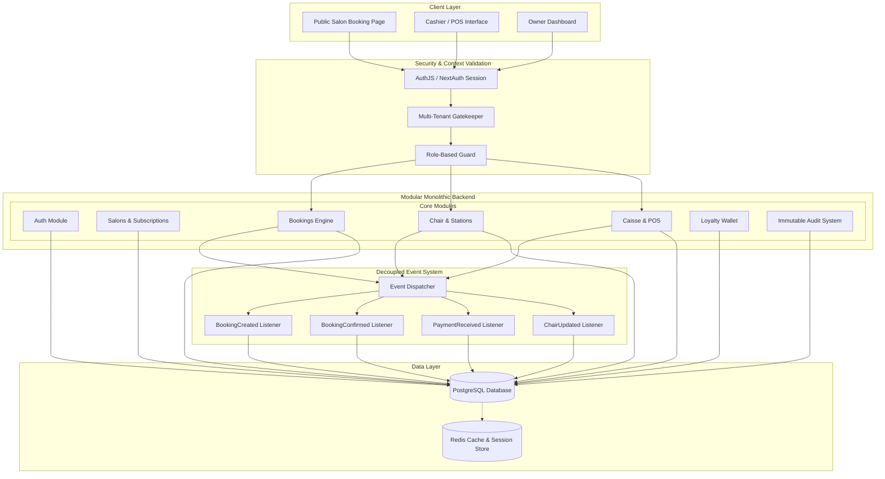

# Luna OS — Enterprise SaaS Architecture & Implementation Plan

This implementation plan details the strategy to bring the **Luna Salon Operating System** to full enterprise production-readiness, meeting all 5 phases of development. It highlights structural, database, security, and architectural gaps in the current Next.js codebase and provides a concrete roadmap to close them.

---

## 1. System Architecture

The system uses a **Modular Monolith** architecture implemented inside a Next.js framework. It utilizes a PostgreSQL database managed by Prisma, a decoupled internal **Event Dispatcher** for async processing, and strict multi-tenant context validation.

### 1.1 Architectural Diagram


---

## 2. Identified Gaps & Refactoring Roadmap

We have performed an exhaustive analysis of the codebase and identified five critical gaps that must be closed:

| Gap ID | Area | Current Implementation | Target Requirements | Priority |
| :--- | :--- | :--- | :--- | :--- |
| **GAP-01** | **Multi-Tenancy & Security** | APIs read `salonId` from request bodies without validating ownership; `auth.ts` limits session roles to `SALON_OWNER`, `CLIENT`, and `ADMIN`. | Strict `salonId` validation on every request; session must support all roles (`CASHIER`, `STAFF`, `STOCK_MANAGER`). | **Blocker** |
| **GAP-02** | **Subscription Validation** | The `Salon` model lacks subscription fields, and there is no gatekeeping middleware to block access on expiration. | `subscriptionStatus` enum, expiry checks, and strict resource lock when status is `EXPIRED` or `PAST_DUE`. | **High** |
| **GAP-03** | **Chair Station Timeline** | `Resource` handles chairs as simple status strings without tracking staff assignments or reservation timelines. | Dedicated `ChairTimeline` model tracking reservations, starts, pauses, completions, and assigned staff with double-booking locks. | **High** |
| **GAP-04** | **Decoupled Event System** | Side-effects (notifications, emails) are hardcoded inside api routes, making them synchronous and tightly coupled. | Decoupled, async-safe `EventDispatcher` firing internal domain events (`BookingCreated`, `PaymentReceived`, etc.). | **Medium** |
| **GAP-05** | **POS Receipt & PDF Billing** | Invoices are created with simple auto-increment codes but lack detailed PDF rendering or client wallet logs. | Automated PDF invoice streaming, client loyalty point allocations, and immutable caisse reports. | **Medium** |

---

## 3. Detailed Database Schema Upgrades (`prisma/schema.prisma`)

To support subscriptions, granular roles, chair timelines, and audit compliance, the Prisma schema must be modified.

### 3.1 Schema Additions
```diff
// prisma/schema.prisma

enum Role {
  CLIENT
  SALON_OWNER
  ADMIN
  CASHIER
  STAFF
  STOCK_MANAGER
}

+ enum SubscriptionStatus {
+   TRIAL
+   ACTIVE
+   PAST_DUE
+   EXPIRED
+   GRACE_PERIOD
+ }

+ enum ChairState {
+   RESERVED
+   STARTED
+   PAUSED
+   COMPLETED
+ }

model Salon {
  id            String          @id @default(cuid())
  name          String
  slug          String          @unique
  logo          String?
  address       String?
  city          String?
  latitude      Float?
  longitude     Float?
  contactPhone  String?
  whatsappPhone String?
  workingHours  Json
+ subscriptionStatus SubscriptionStatus @default(TRIAL)
+ subscriptionExpiresAt DateTime?
  services      Service[]
  bookings      Booking[]
  promoCodes    PromoCode[]
  ownerId       String          @unique
  owner         User            @relation("SalonOwner", fields: [ownerId], references: [id], onDelete: Cascade)
  staff         User[]          @relation("SalonStaff")
  resources     Resource[]
+ chairTimelines ChairTimeline[]
  cashSessions  CashSession[]
  staffSessions StaffSession[]
  products      Product[]
  suppliers     Supplier[]
  purchaseOrders PurchaseOrder[]
  auditLogs     AuditLog[]
  createdAt     DateTime        @default(now())
  updatedAt     DateTime        @updatedAt
}

model Resource {
  id        String   @id @default(cuid())
  name      String
  type      String   // "CHAIR", "ROOM", "BED", "STATION"
  status    String   @default("FREE") // "FREE", "BUSY", "CLEANING", "MAINTENANCE"
  salonId   String
  salon     Salon    @relation(fields: [salonId], references: [id], onDelete: Cascade)
  bookings  Booking[]
+ chairAssignments ChairAssignment[]
+ timelines ChairTimeline[]
  createdAt DateTime @default(now())
  updatedAt DateTime @updatedAt

  @@unique([salonId, name])
  @@index([salonId])
}

+ model ChairAssignment {
+   id          String    @id @default(cuid())
+   resourceId  String
+   staffId     String
+   assignedAt  DateTime  @default(now())
+   revokedAt   DateTime?
+   resource    Resource  @relation(fields: [resourceId], references: [id], onDelete: Cascade)
+   staff       User      @relation(fields: [staffId], references: [id], onDelete: Cascade)
+ 
+   @@index([resourceId])
+   @@index([staffId])
+ }

+ model ChairTimeline {
+   id          String      @id @default(cuid())
+   salonId     String
+   resourceId  String      // Associated chair/station
+   bookingId   String?     @unique
+   staffId     String?     // Assigned service provider
+   state       ChairState  @default(RESERVED)
+   notes       String?
+   startedAt   DateTime?
+   pausedAt    DateTime?
+   completedAt DateTime?
+   createdAt   DateTime    @default(now())
+   updatedAt   DateTime    @updatedAt
+   salon       Salon       @relation(fields: [salonId], references: [id], onDelete: Cascade)
+   resource    Resource    @relation(fields: [resourceId], references: [id], onDelete: Cascade)
+   booking     Booking?    @relation(fields: [bookingId], references: [id], onDelete: SetNull)
+   staff       User?       @relation(fields: [staffId], references: [id], onDelete: SetNull)
+ 
+   @@index([salonId])
+   @@index([resourceId])
+   @@index([staffId])
+ }
```

---

## 4. Modular Monolith Codebase Layout

To support scaling and ensure high code quality, we will align the core logic into a modular format under `lib/modules` and `app/api/modules`:

```
lib/
├── common/                # Shared utilities (DB client, password, contact helpers)
│   ├── prisma.ts
│   ├── password.ts
│   ├── contact.ts
│   └── cn.ts
├── config/                # Environment variables, subscriptions, feature flags
│   └── index.ts
├── events/                # Internal Event-Driven architecture
│   ├── event-dispatcher.ts
│   └── listeners/
│       ├── booking-listener.ts
│       ├── payment-listener.ts
│       └── chair-listener.ts
└── modules/               # Core domain modules containing server-side logic
    ├── auth/              # JWT verification, RBAC rules, verification codes
    ├── salons/            # Salon profiles, working hours, subscription gatekeepers
    ├── bookings/          # Booking slot calculators, serializable locking
    ├── chairs/            # Chair timelines, assignments, overlapping checkers
    ├── caisse/            # Cash sessions, cash flow movements, immutable accounting
    ├── loyalty/           # Loyalty points ledger, manual adjustments
    ├── staff/             # Duty scheduling, permission groups, job templates
    └── audit/             # Immutable audit logger
```

---

## 5. Security & Gatekeeping Middleware

We will implement a unified server-side utility `lib/modules/auth/tenant-guard.ts` to perform multi-tenant security verification on every API route.

```typescript
// lib/modules/auth/tenant-guard.ts
import { auth } from "@/auth";
import prisma from "@/lib/prisma";
import { Role, SubscriptionStatus } from "@/app/generated/prisma/enums";

export interface TenantContext {
  userId: string;
  role: Role;
  salonId: string;
}

export async function validateTenantContext(
  req: Request,
  allowedRoles: Role[]
): Promise<{ error?: string; status?: number; context?: TenantContext }> {
  const session = await auth();
  
  if (!session?.user?.id) {
    return { error: "Unauthorized. Please sign in.", status: 401 };
  }

  const user = await prisma.user.findUnique({
    where: { id: session.user.id },
    select: { id: true, role: true, salonId: true },
  });

  if (!user || !user.salonId) {
    return { error: "User is not associated with any salon.", status: 403 };
  }

  // Enforce role access rules
  if (allowedRoles.length > 0 && !allowedRoles.includes(user.role)) {
    return { error: "Forbidden. Insufficient permissions.", status: 403 };
  }

  // Enforce subscription verification rules
  const salon = await prisma.salon.findUnique({
    where: { id: user.salonId },
    select: { subscriptionStatus: true, subscriptionExpiresAt: true },
  });

  if (!salon) {
    return { error: "Salon configuration not found.", status: 404 };
  }

  const now = new Date();
  const isExpired = 
    salon.subscriptionStatus === SubscriptionStatus.EXPIRED ||
    (salon.subscriptionExpiresAt && salon.subscriptionExpiresAt < now);

  if (isExpired && user.role !== Role.SALON_OWNER && user.role !== Role.ADMIN) {
    return { error: "Access blocked. Your salon's subscription has expired.", status: 402 };
  }

  return {
    context: {
      userId: user.id,
      role: user.role,
      salonId: user.salonId,
    },
  };
}
```

---

## 6. Implementation Sequence

### Phase 1: Core Security & Multi-Tenancy (Current Turn)
1. **Extend Session Roles**: Update `auth.ts` to allow all roles (`CASHIER`, `STAFF`, `STOCK_MANAGER`) to flow correctly into `session.user.role`.
2. **Setup Tenant Guard**: Put `validateTenantContext` into place.
3. **Audit Log System**: Create a global helper in `lib/modules/audit/audit-logger.ts` to create records inside `AuditLog`.

### Phase 2: Refactoring Dashboard Layout & Sidebar
1. Refactor `app/dashboard/layout.tsx` to read the authenticated role.
2. Filter the sidebar navigation dynamically so that:
   - **SALON_OWNER** / **ADMIN**: Accesses everything.
   - **CASHIER**: POS, Bookings, Clients.
   - **STAFF**: Bookings (Assigned Queue), Duty session.
   - **STOCK_MANAGER**: Inventory, Suppliers.

### Phase 3: Decoupled Internal Event System
1. Create `lib/events/event-dispatcher.ts` and set up standard listeners to process background alerts, notifications, and logging on events.

### Phase 4: Chair/Station Lifecycle API
1. Implement overlapping locks and state transition APIs for chairs (`/api/chairs/timeline`).

### Phase 5: POS Immutability & Invoice PDF Flow
1. Block any transaction adjustments unless logged as a corrective action. Stream clean thermal and client receipt invoices directly from the database.

---

> [!IMPORTANT]
> To maintain complete stability, database schema changes should be applied via Prisma migrations, and all database reads/writes must explicitly pass `salonId` to guarantee that no data leakage between salons can occur.
